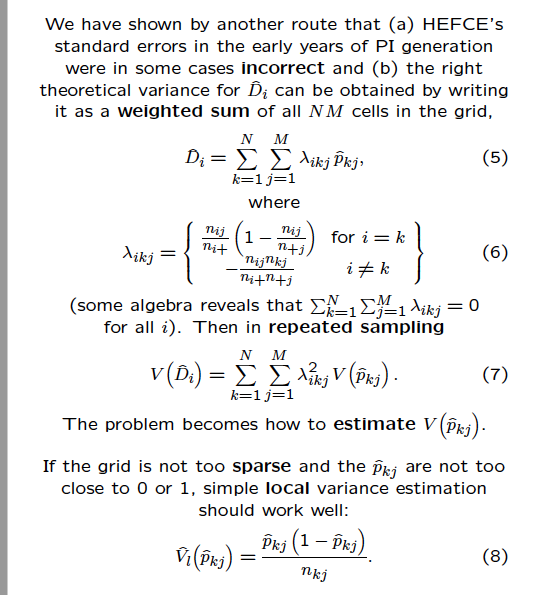

---
title: 'Benchmarking in the TEF: have they got the sums wrong?'
author: "Dorothy Bishop, with thanks to Alistair Bailey for help with code improvement"
date: "2nd March 2019"
always_allow_html: yes
output:
  html_document: default
  pdf_document: default
  word_document: default
---
  
```{r setup, include=FALSE}
knitr::opts_chunk$set(echo = TRUE)
# For pretty tables
library(kableExtra)
library(tidyverse)
# For cleaning names
library(janitor)
```

## Benchmarking and the TEF
N. B. This gives the background and computations relevant to this blogpost
http://deevybee.blogspot.com/2019/03/benchmarking-in-tef-something-doesnt.html

I'm a long-term critic of the Teaching Excellence and Student Outcomes Framework (TEF). I've put forward a swathe of arguments against the rationale for TEF in [this lecture](https://www.slideshare.net/deevybishop/southampton-lecture-on-tef), as well as blogging for the Council for Defence of British Universities (CDBU) about problems with its [rationale](http://cdbu.org.uk/tef-an-ill-conceived-solution-to-a-wrongly-posed-problem/) and [statistical methods](http://cdbu.org.uk/the-problem-with-tef-a-look-at-the-technical-failings/). 

This week, the Royal Statistical Society wrote a [scathing report](https://www.rss.org.uk/Images/PDF/influencing-change/2019/RSS_Evidence_to_the_TEF_consultation_Feb2019.pdf) on the statistical limitations of TEF, stating: '**We are extremely worried about the entire benchmarking concept and implementation. It is at the heart of TEF and has an inordinately large influence on the final TEF outcome**', and expressing particular concern about the lack of clarity on the benchmarking methodology, which seems to yield some strange results.

This reflects concerns I have had, which have led me to do further analyses of the publicly available TEF datasets. The conclusion I have come to is that benchmarking is not just conceptually flawed, but is based on a formula which contains an algebraic error that leads to unusually large z-scores. There is some guesswork involved in my analysis, because - as I pointed out in my second CDBU blogpost - there is no script available to show the workings of the benchmarking computations. Furthermore, my understanding of the mathematical aspects of benchmarking is limited. But the bottom line is that there is a key formula that incorporates a computed weight, lambda. TEF benchmarking follows the method of Draper and Gittoes (2004), in which standard errors for difference scores incorporate a squared lambda term. This yields a weird distribution of z-scores, which was noted by Draper and Gittoes. If you substitute the the square root of lambda, the z-scores behave much more in line with expectation. 

Needless, to say, this is all quite technical, but even if you don't follow the maths, I suggest you just consider the analyses reported below, in which I compare the benchmarking output from the Draper and Gittoes method with that from an alternative approach.

## Draper & Gittoes: a toy example

Benchmarking is intended to provide a way of comparing institutions on some metric, while taking into account  differences between institutions in characteristics that might be expected to affect their performance, such as the subjects of study, and the social backgrounds of students. I will refer to these as 'contextual factors'.

The method used to do benchmarking comes from [Draper and Gittoes, 2004](https://rss.onlinelibrary.wiley.com/doi/abs/10.1111/j.1467-985X.2004.apm12.x), and is explained in this [document by the Higher Education Statistics Agency: HESA](https://www.hesa.ac.uk/data-and-analysis/performance-indicators/benchmarks). A further statistical treatment and critique can be found in slides from a talk by Draper [here](https://users.soe.ucsc.edu/~draper/draper-talk-for-siena-meeting-12sep06.pdf).

Draper provides a 'small world' example with 5 universities and 2 binary contextual categories, age and gender, to yield four combinations of contextual factors.

```{r smallworldeg, include=FALSE}
#Draper's toy data
toynames<-c('RCN','Newport','UWE','Bath','Cambridge')

smallworldoutcomes <-data.frame(matrix(c(0,0,.800, .800,
                                         .838, .889, .819, .878, 
                                         .897, .923, .868, .905, 
                                         .941, .972, .884, .887,
                                         .993, .992, .958, .969),nrow=5,byrow=TRUE))
smallworldN<-data.frame(matrix(c(0, 0, 5, 50, 
                                 198, 271, 227, 205,
                                 2133, 2099, 1443, 1156, 
                                 712, 501, 69, 62, 
                                 1467, 1176, 144, 130),nrow=5,byrow=TRUE))
colnames(smallworldoutcomes) <-c('YoungM','YoungF','MatureM','MatureF')
colnames(smallworldN)<-c('YoungM','YoungF','MatureM','MatureF')
rownames(smallworldoutcomes) <- toynames
rownames(smallworldN) <- toynames

smallworldoutcomes  %>% kable(booktabs = T, caption = "Small World Example from Draper (2006), % Students completing") %>% 
  kable_styling()
smallworldN %>% kable(booktabs = T, caption = "Small World Example, N") %>% 
  kable_styling()

```
Essentially, the obtained score for an institution is an average of indicator values for each combination of contextual factors, weighted by the numbers with each combination of contextual factors in the institution. The benchmarked score is computed by taking the average score for each combination across all institutions and then for each institution creating a mean score, weighted by the number in each category for a that institution. Though cumbersome (and hard to explain in words!) it is not difficult to compute. The difference between obtained values and benchmarked value can then be computed, to see if the institution is scoring above expectation (positive difference) or below expectation (negative difference). This function computes the benchmarks for the toy example from Draper.

```{r benchmark_function, include=TRUE}
#################################################################################
makebenchmark<- function(outcomes,Ns){
phat<-rep(0,nrow(Ns))
pj<-rep(0,ncol(Ns))
for (i in 1:nrow(Ns)){
  for (j in 1:ncol(Ns)){
  phat[i]<-phat[i]+(outcomes[i,j]*Ns[i,j])
  pj[j]<-pj[j]+(outcomes[i,j]*Ns[i,j])
  }
}
phat<-phat/rowSums(Ns) #this is weighted mean for each institution -ie obs value
pj<-pj/colSums(Ns) #this is weighted mean for each context category (PCF)

expvalue<-rep(0,nrow(Ns))
for (i in 1:nrow(Ns)){
  for (j in 1:ncol(Ns)){
  expvalue[i]<-expvalue[i]+(Ns[i,j]*pj[j])
  }
}
expvalue<-expvalue/rowSums(Ns) #this is benchmark value
diff <- phat-expvalue #percentage points difference from benchmark
myrowsums<-rowSums(Ns) #total N for institution

#make a little data frame to contain benchmarking results
allbench<-data.frame(cbind(myrowsums,phat,expvalue,diff))
colnames(allbench) <- c('N','observed','benchmark','diff')
return(allbench)
}
```


```{r smallworldcompute, include=FALSE}

toybench<-makebenchmark(smallworldoutcomes, smallworldN)
#last term in function is multiplier for lambda in the DB version
toybench %>% kable(booktabs = T, caption = "Small World Example, benchmarks") %>% 
  kable_styling()
```

### Additional example (not essential here)

A worked example of how benchmarks are derived in TEF can be found in Annex B of [this document](https://www.officeforstudents.org.uk/media/c32f61aa-ceb7-4bbb-9f87-2cfc60f2bf89/tefyearfour_metricstechnicalalgorithmsandrebuildinstructions_revised20181219.pdf). This is set out differently from the Draper example, with data just on one provider and the whole sector, but the function above can be used with it by just treating this as data from two institutions, with institution 2's values obtained by subtracting Institution 1's data from the total. I did this just to confirm that the TEF method was the same as that used above.

```{r AnnexB.eg, include=FALSE}
# To use my function with this, I will just treat this as 2 unis
# This confirms that the benchmark is same as given in the e.g.

# There's also something odd - the z-scores for Uni1 and Uni2 given by the DG formula are identical but opposite in sign - that seems odd given that Uni2 is 20 x as big as Uni1.

#Is there a clue here to what's wrong with the formula?

tefoutcomes <-data.frame(matrix(c(.95,0,.92,.94,0,.98,
                                  .95,.99,.95,.94,.98,.98),ncol=6,byrow=TRUE))
tefN <-data.frame(matrix(c(500,0,150,400,0,40,
                            19500,80000,94850,4600,6500,3960),ncol=6,byrow=TRUE))


instnames<-c('Uni1','Uni2')


colnames(tefoutcomes) <-c('Young.Agri','Young.Hist','Young.Maths',
                          'Mature.Agri','Mature.Hist','Mature.Maths')
colnames(tefN)<-colnames(tefoutcomes)
rownames(tefoutcomes) <- instnames
rownames(tefN) <- instnames
tefz<-makebenchmark(tefoutcomes, tefN)
#

```

One small aside. Although the benchmarking formula is algebraically correct, the logic of benchmarking raises many questions. These are not my current focus, but are covered in previous critiques. One point concerns the criteria for a benchmark. It is noted that the benchmark should be associated with the outcome metric. However, if a benchmark is not equally distributed across institutions, this can create problems. I would argue that a benchmark should be associated with outcomes *within institutions* for it to be regarded as valid. Obviously this may be hard to demonstrate for small institutions, but where there is enough data, then it should be tested. Consider the situation for subject of study: if one set of institutions, A, offers medicine but not accountancy, and another set, B, offers accountancy but not medicine, then higher ratings for medicine than accountancy could just be a consequence of differences between institutions. We would need to find institutions that offer both subjects and show that medicine outperforms accountancy within institution to be confident there is a true subject-related difference to be adjusted for. 

This point, however, pales into insignificance compared to the main issue: computation of standard errors of difference scores.


## Computing standard errors of difference scores

The next step is far more complex. A z-score is computed by dividing the difference between observed and expected values on an indicator by a denominator, which is variously referred to as a standard deviation and a standard error in the documents on benchmarking. We shall refer to it as a standard error; it takes into account the sample size at each institution, reflecting the fact that the measurement error associated with a difference score will be greater for small than large samples.

For those who are not trained in statistics, the basic logic here is that the estimate of an institution's performance will be more labile if it is based on a small sample. If the institution takes on only 5 students each year, then estimates of completion rates from year to year will be variable - in a year where one student drops out, then the completion rate is only 80%, but if none drop out it will be 100%. You would not expect it to be constant because of random factors outside the control of the institution will affect student drop-outs. In contrast, for an institution with 1000 students, we will see much less variation from year to year. The standard error provides an estimate of the extent to which we expect the estimate of average drop-out to vary from year to year, taking size of population into account.  

To interpret benchmarked scores we need a way of estimating the standard error of the difference between the observed score on a metric (such as completion rate) and the benchmarked score, reflecting how much we would expect this to vary from one occasion to another. Only then can we judge whether the institution's performance is in line with expectation.  

Draper (2006) walks the reader through a standard method for computing the standard errors, as shown in Figure 1. This is illustrated with data from a 'small world' dataset.



The *makeSE* function below computes the benchmarks, difference and standard errors using the Figure 1 formulae. Its use is illustrated with the 'small world' dataset, showing that results agree with those of Draper (2006). (You can ignore for now the lines of the function that are used to explore alternative methods of computing the variance).


```{r makeSE}
# How to get SE for the difference?  See p 20 of Draper 2006

#'If the grid is not too sparse and the ^pkj are not too close to 0 or 1, simple local variance estimation should work well'
makeSE<- function(outcomes,Ns,mymult){
  
  allbench<-makebenchmark(outcomes,Ns) #start by computing benchmarks using previous function
  localvar <- outcomes*(1-outcomes)/Ns

# account of next step is confusing because we now have 3 subscripts, i, j and k
# j and k are what were previously i and j (institution and benchmark)
# i is just a value from 1 to k that determines value of lambda
# By specifying lambda, can create expression to compute Differences, that also allows deriviation of variance of D
# All a bit mindboggling, but this script replicates the Draper e.g.
vDG<-rep(0,nrow(Ns)) #initialise variance estimate for difference score with DG formula
vDGsd<-vabslam<-vnolambda<-vDB<-vDG #make vector for variance estimate with DB modified formula, or no lambda

d<-rep(0,nrow(Ns)) #vector for differences: to check that lambda term recreates the differences
myrowsums<-rowSums(Ns)
mycolsums<-colSums(Ns)
for (k in 1:nrow(Ns)){
  for (i in 1:nrow(Ns)){
    for (j in 1:ncol(Ns)){
      lambda<- ifelse(i!=k,(-Ns[i,j]*Ns[k,j])/
                        (myrowsums[i]*mycolsums[j]),
      (Ns[i,j]/myrowsums[i])*(1-(Ns[i,j]/mycolsums[j])) )
       
      addbit <-lambda*outcomes[k,j] #this will be used to recreate the difference scores (formula 5)
      addbit1 <-lambda^2*localvar[k,j] #this is the original Draper formula
      
      #Additional methods evaluated for exploring results when different versions of lambda used when computing formula 7
      addbit2<-outcomes[k,j] #no lambda
      addbit3<-mymult*sqrt(abs(lambda))*localvar[k,j] #DB; uses mymult*sqrt rather than squared lambda
      addbit4 <-abs(lambda)*localvar[k,j] #Unsquared lambda
        addbit5 <-addbit1*sqrt(Ns[k,j]) #SD rather than SE
        if(is.na(addbit1)==FALSE){
        d[i] <- d[i]+addbit #this should recreate the previously computed difference values in diff
        
        #the following lines compare different methods for estimating variance of difference scores
        vDG[i]<-vDG[i]+addbit1 #original Draper Gittoes method 
        vDGsd[i]<-vDGsd[i]+addbit5
        vnolambda[i] <- vnolambda[i]+addbit2 #exclude lambda
        vDB[i] <- vDB[i]+addbit3 #use squareroot rather than squared lambda
        vabslam[i]<-vabslam[i]+addbit4 #use absolute value of lambda
      }
    }
  }
}
#zscore obtained by dividing difference scores by the SE, which is squareroot of variance
zDG<-d/sqrt(vDG) #zscores computed using DraperGittoes method for SE
zDGsd<-d/sqrt(vDGsd)
znolambda<-d/sqrt(vnolambda)
zDB<-d/sqrt(vDB)
zabslam<-d/sqrt(vabslam)
zDGsd1<-d/(sqrt(myrowsums)* sqrt(vDG))
allz<-data.frame(cbind(allbench,zDG,zDB,zDGsd1))
colnames(allz) <- c('N','observed','benchmark','diff','z.DG','z.DB','z.DGsd1')
return(allz)
}
```

```{r smallworldSE, echo=FALSE}
# apply makeSE to Draper's toy data

mymult<-.5 #multiplier for lambda term in DB version: ignore this for now
toyz<-makeSE(smallworldoutcomes, smallworldN,mymult)
#last term in function is multiplier for lambda in the DB version
toyz[,1:5] %>% kable(booktabs = T, caption = "Small World Example, z-scores") %>% 
  kable_styling()
```


As noted by Draper (2006) the absolute z-scores given by this method seem remarkably large: In this toy example, we see z-scores with absolute values of 5, 9 and 20. 

Yet, they are used in TEF as if they are regular z-scores, i.e.:

From p.42  [Technical Specifications](https://assets.publishing.service.gov.uk/government/uploads/system/uploads/attachment_data/file/658490/Teaching_Excellence_and_Student_Outcomes_Framework_Specification.pdf)

*"In TEF metrics the number of standard deviations that the indicator is from the benchmark is given as the Z-score. Differences from a benchmark with a Z-score +/-1.9623 will be considered statistically significant. This is equivalent to a 95% confidence interval (that is, we can have 95% confidence that the difference is not due to chance)."*

The HESA documents note that it is very easy with this method to get huge absolute values for z-scores, and they deal with this by only flagging up high values if they also meet a second criterion:  the absolute size of difference had to be at least 2% for a single flag, or 3% for a double flag. This is an arbitrary criterion, designed to avoid the fact that trivial differences would otherwise show up as meaningful.

## Z-scores from simulated data

I wanted to check whether these strikingly high z-scores were correctly computed. One way to do that is to simulate some data where there are no true quality differences between institutions - in other words, one can just simulate a set of random numbers - both for the metrics and for sample sizes. If the z-scores from the Draper-Gittoes formula are correct, then z-scores obtained with this approach should range from around -3 to +3.  But they don't, as the histogram below shows. 

These data were simulated using the *rnorm* function in R, with mean value for the indicator of .6 and SD of .2. I have tried varying these values, and have also modified the simulation to make the sample sizes more realistic (as in reality they are strongly skewed, with a few enormous institutions). Overall, regardless of the setting of the simulation, you see z-scores that are considerably larger, in both positive and negative directions, than you would expect if the SEs were correct.

Furthermore, extreme z-scores are much more common in big than in small institutions, as shown below. This is also a feature of real TEF data, as I discussed in [this blogpost] (http://cdbu.org.uk/the-problem-with-tef-a-look-at-the-technical-failings) (see point 3).


```{r simforbench, echo=FALSE}
#simulate many unis on 2 x 2 contextual factors
# User can specify mean and SD for the benchmark
for (mysd in c(.2)){ #can look at impact of varying SD by specifying a list of values here
for(mymean in c(.6)){#mean benchmark level
  rerun<-1 #set to 1 to simulate data (simulation takes a few minutes)
#if you have already run this, data are saved as RDS and can just be reloaded (see below) if you set rerun to zero
mymult<-.5 #multiplier for the lambda term in DB version - to be explained later
nuni<-100
ncontext<-4 #N contextual factors combinations (as in 'small world' simulation)


mymat <- data.frame(matrix(rnorm(nuni*ncontext,mymean,mysd),nrow=nuni))

mymat[mymat>1]<-.99 #censor values > 1 

myNmat <-data.frame(matrix(rnorm(nuni*ncontext,500,100),nrow=nuni)) # just set N as random for each cell

#it's possible to simulate more realistic Ns etc, e.g. 
# use random number as a multiplier reflecting total N at institution
# then use exp(N*runif()) to then specify  Ns for cells
# This code does that - generates skewed distribution with some v large N
  myN <- rnorm(nuni,8,1) #arbitrary number selected to give realistic looking Ns
  myNmat <- data.frame(matrix(runif(nuni*ncontext),nrow=nuni)) #proportions in cells are random
  for (i in 1:nuni){
  myNmat[i,]<-round(100+exp(myNmat[i,]*myN[i]),0)
  }
myNmat<-  round(myNmat,0)


fileRDS<-paste0('simulated data/simulated_z_Nuni',nuni,'_ncontext',ncontext,'_mean',mymean,'_sd',mysd,'_mult',mymult,'_logN')  ##filename for saving simz to RDS

if(rerun==0){
simz<-readRDS(fileRDS)  #if this file exists, just read it in
}
if (rerun==1){
  simz<-makeSE(mymat,myNmat,mymult) #this line recreates the simulated results - slow to run
}

saveRDS(simz, fileRDS) #save the data to RDS format - can just load in on rerun

#Plot the z-scores
hist(simz[,5],breaks=40,main='Draper-Gittoes z-scores from random data',xlab='z-score',col='red')
w<-which(abs(simz[,5])>3) #zscore > 2
mytext<-paste0('% with absolute z-score > 3 = ',100*length(w)/nuni,'%')
text(80,100,mytext,cex=.8)

#Second plot shows how z-scores relate to sample size, using logN
plot(log(simz[,1]),simz[,5],ylab='Draper-Gittoes z-score',xlab='logN',main='Draper-Gittoes method with random data, z-score by log N')

}
}

```

These plots indicate there is something wrong with the z-score estimates. In particular, it looks like the estimate of the standard error is too small.

This result is at odds with this statement from the Technical Specificiations document (5.63):

*As a test of the likelihood that a difference between a provider’s benchmark and its indicator is due to chance alone, a z-score +/- 3.0 means the likelihood of the difference being due to chance alone has reduced substantially and is negligible.*

Given that applying the Draper-Gittoes formula to completely random data gives absolute z-scores greater than 3 on 76% of occasions, this conclusion can be questioned.

A great deal hinges on the computation of lambda, which, as is evident from Figure 1, is not simple. I did, of course, wonder whether the *makeSE* function was correct.  

There are two reasons to have confidence that the computations in *makeSE* are doing the benchmarking in the same way as is done in TEF. 

First, as specified in Formula (5) in Figure 1, when correctly computed, lambda can be used to compute the difference scores (observed minus expected values) for a metric. This is done in the *makeSE* function above, and it gives the correct results for difference scores.  

Second, the high numbers of extreme z-scores obtained with the *makeSE* function are not dissimilar to those obtained with real data. To demonstrate that point, we now go on to load in data from TEF year 2. We use [this dataset](https://www.officeforstudents.org.uk/media/2ebea92b-caa6-429c-902b-fbd390c6d046/tef_y2_allmetrics.csv) (from 2017), as it has the awards (Bronze, Silver, Gold) as well as the raw data. The computed z-scores are provided in the raw data file, and are plotted for Core data for each metric below. It is evident that absolute z-scores greater than 3 are common - with the exact number varying from metric to metric, but ranging from 33% to 58%.

```{r read2017,echo=FALSE, warnings=FALSE,message=FALSE}

tef2url<-'https://www.officeforstudents.org.uk/media/2ebea92b-caa6-429c-902b-fbd390c6d046/tef_y2_allmetrics.csv'
# Create data directory if not already present
if(!dir.exists('rawdata')){dir.create('rawdata')}
# Download data if not already downloaded
if(!file.exists("rawdata/TEF_y2_AllMetrics.csv")){
  download.file(tef4Url,destfile="rawdata/TEF_yr_AllMetrics.csv")}
tef2017file<-read_csv('rawdata//TEF_y2_AllMetrics.csv',na = c(" ","N/A","")) %>% clean_names()

#Argh - has all sorts of missing data codes in here that make everything read as characters
# (NB data from later years are better in this regard)

#Some data wrangling needed
tef2017file$numerator<-as.numeric(tef2017file$numerator)
tef2017file$indicator<-as.numeric(tef2017file$indicator)
tef2017file$benchmark<-as.numeric(tef2017file$benchmark)
tef2017file$numerator<-as.numeric(tef2017file$numerator)
tef2017file$percentcontributiontobenchmark<-as.numeric(tef2017file$percentcontributiontobenchmark)
tef2017file$difference<-as.numeric(tef2017file$difference)
tef2017file$standarddeviation<-as.numeric(tef2017file$standarddeviation)
tef2017file$zscore<-as.numeric(tef2017file$zscore)
tef2017file$provider_tefaward<-as.factor(tef2017file$provider_tefaward)
tef2017file$provider_name<-as.factor(tef2017file$provider_name)

```

```{r recodeflags, echo=FALSE}
#recode flags
tef2017file$flag<-recode(tef2017file$flag, "--" = 1, "-" = 2, "=" = 3, "+" = 4,"++" = 5,  .default = 9)
w<-which(tef2017file$flag==9)
tef2017file$flag[w]<-NA
```

```{r checkz,echo=FALSE}
#To look at z-scores we'll work with a reduced file, so we just select Full Time, Core data
#This file has one z-score per provider for each of 6 metrics

mycore2017<-filter(tef2017file,provider_majoritymode=='FullTime',modeofstudy=='FullTime',split_id=='Core')
metriclist<-unique(mycore2017$metric)
for (i in 1:length(metriclist)){
  temp<-filter(mycore2017,metric==metriclist[i])
 w<-which(abs(temp$zscore)>3)
bigz<-100*length(w)/nrow(temp)
mytext<-paste0('% with absolute z-score > 3 = \n',round(bigz,1),'%')

hist(temp$zscore, breaks=40,main=metriclist[i],xlab='zscore',col='red')
textxplace <-min(temp$zscore,na.rm=TRUE)+5
text(textxplace,15,mytext,cex=.8)
}
```

It does seem remarkable that HESA has continued to use this benchmarking method despite the fact it yields such extreme z-scores. The method seems designed to over-identify high and low-achieving institutions. The only step taken to counteract this trend is an ad hoc one: because large institutions are particularly prone to obtain extreme scores, a large absolute z-score is only flagged as 'significant' if the absolute difference score is also greater than 2 or 3 percentage points. Nevertheless, the number of flagged institutions for each metric, is still far higher than we would expect if the z-scores were accurate.

## Exploring alternative formulae for SE calculation

I wondered if there might be an error in the formula used to compute the z-scores. My attempt to investigate this was decidedly exploratory: I noted that formula 7 in Figure 1 involved using a squared value of lambda in a weighted sum. Given that lambda values were usually much smaller than 1, the squared values were minute. I experimented with taking the square root of lambda as a multiplier instead. This gives a distribution of z-scores that looks far more like one would expect. With simulated random data, the range of z-scores depends on the standard deviation specified when simulating the data, but is generally no greater than +/- 4. The plot below shows the z-scores obtained with the same random dataset shown above with the Draper-Gittoes method. Note that as well as giving a more plausible range of z-scores, this method does not show the strikingly greater dispersion of z-scores with sample size that is obtained when the Draper-Gittoes method is used. 

```{r sqrtsim, echo=FALSE}
#Plot the z-scores
hist(simz[,6],breaks=40,main='Sqrt.lambda method: z-scores from random data',xlab='z-score')
w1<-which(abs(simz[,6])>3) #rate for alternative DB index based on sqrt lambda
mytext<-paste0('% with absolute z-score > 3 = ',100*length(w1)/nuni,'%')
text(-2.5,60,mytext,cex=.8)
plot(log(simz[,1]),simz[,6],ylab='z-score',xlab='logN',main='Sqrt.lambda method with random data, z-score by log N')

```

The relationship between zscores obtained using lambda squared vs squareroot lambda is shown in the next Figure. This uses the simulated random data described above. One can see that, by flagging institutions with Draper-Gittoes absolute z-scores greater than 2, a very large proportion of institutions would be identified as 'significant', when in fact the alternative method of computing z-scores suggests their difference scores are well within normal limits.

It is important to bear in mind that when working with simulated data, the precise details will depend on factors such as the variance and distribution of scores. I have not explored these aspects in detail. My purpose here is just to note that the distribution of z-scores from the Draper-Gittoes method is very strange, and it is plausible that there could be an algebraic error involved in the use of lambda squared, which leads to very small standard errors. I'm not clear whether the use of a square root lambda weighting makes sense statistically: I just tried this as an empirical alternative, and was interested to see that it seemed to behave in a more orderly manner. Nevertheless, I have found that where the SD of the simulated metric is small, use of square root lambda gives too restricted a range of z-scores, with no extreme values at all. I cannot therefore recommend this as an alternative: I can only note that the current Draper-Gittoes method is problematic.

```{r plotDGvsDB, echo=FALSE}

plot(simz[,5],simz[,6],xlab='Draper-Gittoes (lambda squared)',ylab='sqrt lambda method',main='Z-scores obtained from same data using two methods',pch='+')
abline(v=-2,lty=2)
abline(v=2,lty=2)
```

## Conversion of z-scores into flags

In TEF benchmarking, z-scores are converted into 'flags', ranging from - - or -, to denote performance below expectation, up to + or ++ for performance above expectation, with = used to indicate performance in line with expectation. It is these flags that the TEF panel considers when deciding which award (Gold, Silver or Bronze) to award. 

Draper-Gittoes z-scores are flagged for significance as follows:  
a) - - z-score of -3 or less, AND an absolute difference between observed and expected values of 3%.  
 
b) - z-score of -2 or less, AND an absolute difference between observed and expected values of 2%.  
 
c) + z-score of 2 or more, AND an absolute difference between observed and expected values of 2%.  
 
d) ++ z-score of 3 or more, AND an absolute difference between observed and expected values of 3%.  

Given the problems with the method outlined above, this method is likely to massively overdiagnose both problems and good performance.
 
## Using quantiles rather than z-scores
 
Given that the z-scores obtained with the Draper-Gittoes method are so extreme, it could be argued that flags should be based on quantiles rather than z-score cutoffs, omitting the additional absolute difference criterion. For instance, for the Year 2 TEF data plotted above, we can find cutoffs corresponding to the most extreme 5% or 1%.

```{r makequants, echo=FALSE}

myquants<-c(0.001, .01, .05,.95,.99,1)# cutoffs for most extreme 1% and 5% at top and bottom

quantbreaks<-quantile(mycore2017$zscore,probs = myquants,na.rm=TRUE)
print('Quantile breaks in zscores for Year 2 z-scores from Core Full Time: ')
print(quantbreaks)

```

Suppose we adopted a quantile method of scoring based on these numbers. Then we would award extreme flags (- - or ++) only to those with negative z-scores of -13.7 or less, or positive score of 14.6 or more; less extreme flags would be awarded to those with negative z-score of -7 or less (- flag), or positive z-score of 8.6 or more (+).

As a next step, we will add these new flags to the Year 2 data.

```{r makenewflags, echo=FALSE}
mycore2017$newflag <- 3
mycore2017$newflag[mycore2017$zscore<quantbreaks[3]]<-2
mycore2017$newflag[mycore2017$zscore<quantbreaks[2]]<-1
mycore2017$newflag[mycore2017$zscore>quantbreaks[4]]<-4
mycore2017$newflag[mycore2017$zscore>quantbreaks[5]]<-5
newflagtab<-table(mycore2017$flag,mycore2017$newflag)
#newflagtab shows relationship between old flags (rows) and newflags (cols))

#If I was wanting to go the whole hog, it might be better to do this separately for each metric.
#But given that original TEF method was applied constantly across metrics, I'm sticking to this.

```

It is interesting to consider how this might affect the allocation of bronze and gold awards. The mapping from raw data to awards is complex and involves more than just a consideration of flags. Furthermore, as well as the core metrics, which we have looked at above, the split metrics are also considered - i.e. flags are also awarded for subcategories, such as male/female, disabled/non-disabled: in all there are around 130 flags awarded across the six metrics for each institution. But not all flags are treated equally: the three metrics based on the National Student Survey are given half the weight of other metrics. The following section is taking from the official guidance:

## How metrics determine Gold, Silver or Bronze

From p.57-58 [Technical Specifications](https://assets.publishing.service.gov.uk/government/uploads/system/uploads/attachment_data/file/658490/Teaching_Excellence_and_Student_Outcomes_Framework_Specification.pdf) (N.B. where reference is made to 7.10, this refers to the fact that flags are awarded half a point for NSS metrics and a full point for other metrics).

"*When looking at the relevant delivery mode(s)*:

*Step 1 Review core and split metrics, very high or low absolute values and other factors*

*Step 2 Review the provider submission and supplementary metrics*

*Step 3 Review the provider’s performance holistically. Panellists and assessors start by considering a provider’s core metrics flags in majority mode.They then review all the metrics including the splits, absolute values and other factors to form an initial hypothesis of a rating Panellists and assessors then review the provider’s submission and supplementary metrics.They test the initial hypothesis to see if there is anything that causes them to take a different view of their initial rating Panellists and assessors then look holistically at their judgements. They consider the combination of evidence in the metrics and the submission against the assessment criteria, to make a ‘best fit’ judgement using the rating descriptors*

+ *A provider with positive flags (either + or ++) in core metrics that have a total value of 2.5 (after accounting for the weighting set out in 7.10) or more and no negative flags (either - or -- ) should be considered initially as Gold. *
+ *A provider with negative flags in core metrics that have a total value of 1.5 or more (after accounting for the weighting set out in 7.10) should be considered initially as Bronze, regardless of the number of positive flags. *
+ *All other providers, including those with no flags at all, should be considered initially as Silver.*"

In the tables below, I have selected institutions that obtained a Bronze or Gold award, and computed the 'total value' scores for the original flags, as specified for the TEF. Against this, I have added a new flag score that would be obtained if flags were awarded according to the quantile scores given above, again awarding half points to the three NSS metrics. 

Clearly this makes a huge difference to outcomes. Because extreme scores are far less common if quantiles are used, most institutions awarded Bronze or Gold would no longer qualify, because their z-scores are no longer flagged up as significant.

```{r checkaward, echo=FALSE}
for (thisaward in c('Bronze','Gold')){
myaward <- filter(mycore2017,provider_tefaward==thisaward)
metriclist<-unique(myaward$metric)
myaward$provider_name<-strtrim(myaward$provider_name,25)
unilist<-unique(myaward$provider_name)
naward<-length(unilist)
nmetric<-length(metriclist)
#want to reshape this to display z-scores for each metric for these institutions
aggdata1 <-aggregate(myaward$zscore, by=list(myaward$provider_name,myaward$metric),
  FUN=mean, na.rm=TRUE)
aggdata2 <-aggregate(myaward$flag, by=list(myaward$provider_name,myaward$metric),
  FUN=mean, na.rm=TRUE)
aggdata3 <-aggregate(myaward$newflag, by=list(myaward$provider_name,myaward$metric),
  FUN=mean, na.rm=TRUE)
metrictable<-data.frame(matrix(NA,nrow=naward,ncol=(nmetric*3+1)))
colnames(metrictable)<-c('Provider','Teachingz','Assessmentz','Supportz','NonContz','Employmentz','HighSkilledz',
                'Teaching.flag','Assessment.flag','Support.flag','NonCont.flag','Employment.flag','HighSkilled.flag', 
               'Teaching.newflag','Assessment.newflag','Support.newflag','NonCont.newflag','Employment.newflag','HighSkilled.newflag'  )
blocklength<-nrow(aggdata1)/nmetric
metrictable$Provider <-aggdata1$Group.1[1:blocklength]
for (i in 1:nmetric){
  startblock<-1+(i-1)*blocklength
  endblock<-blocklength*i
  metrictable[,(i+1)]<-aggdata1[startblock:endblock,3]
  metrictable[,(nmetric+i+1)]<-aggdata2[startblock:endblock,3]
  metrictable[,(2*nmetric+i+1)]<-aggdata3[startblock:endblock,3]
}
metrictable[,8:19]<-metrictable[8:19]-3 #convert from 1:5 to -2 to +2
metrictable$oldflagscore <-.5*rowSums(metrictable[,8:10],na.rm=TRUE)+rowSums(metrictable[,11:13],na.rm=TRUE)
metrictable$newflagscore <-.5*rowSums(metrictable[,14:16],na.rm=TRUE)+rowSums(metrictable[,17:19],na.rm=TRUE)
if(thisaward=='Bronze'){
  bronzetable<-metrictable
}
}
print('Bronze awards, 2017')
print(bronzetable[order(bronzetable$oldflagscore),c(1,20,21)])
print('Gold awards, 2017')
print(metrictable[order(metrictable$oldflagscore),c(1,20,21)])
```

It is noteworthy that there was a great deal of publicity around the award of Bronze to certain high-profile institutions, in particularly the London School of Economics, Southampton University, University of Liverpool and the School of Oriental and African Studies. On the basis of quantile scores for Core metrics, none of these would meet criteria for Bronze: their flag scores would be -1, 0, -.5 and 0 respectively. But these are not the only institutions to see a change in award when quantiles are used. The majority of smaller institutions awarded Bronze obtain flag scores of zero.

The same is true of Gold Awards. Most institutions that were deemed to significantly outperform their benchmarks no longer do so if quantiles are used.

Should we therefore change the criteria used in benchmarking and adopt quantile scores? Because I think there are other conceptual problems with benchmarking, and indeed with TEF in general, I would not make that recommendation. I would prefer to see TEF abandoned. I hope the current analysis can at least draw people's attention to the questionable use of statistics used in deriving z-scores and their corresponding flags. The difference between a Bronze, Silver and Gold can potentially have a large impact on an institution's reputation. The current system for allocating these awards is not, to my mind, defensible. I will, of course, be receptive to attempts to defend it or to show errors in my analysis. 
